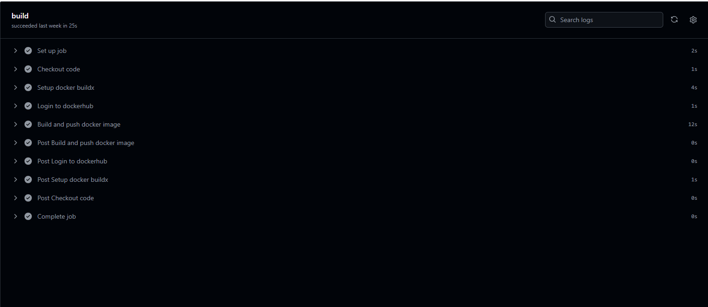
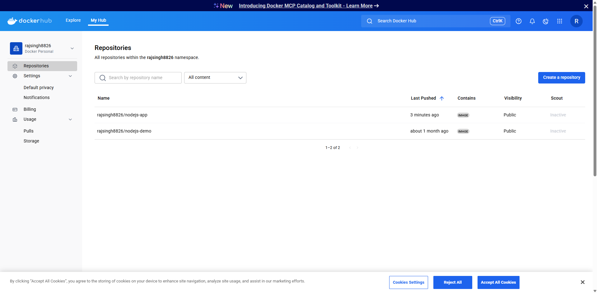
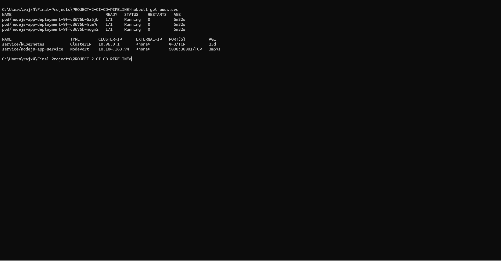
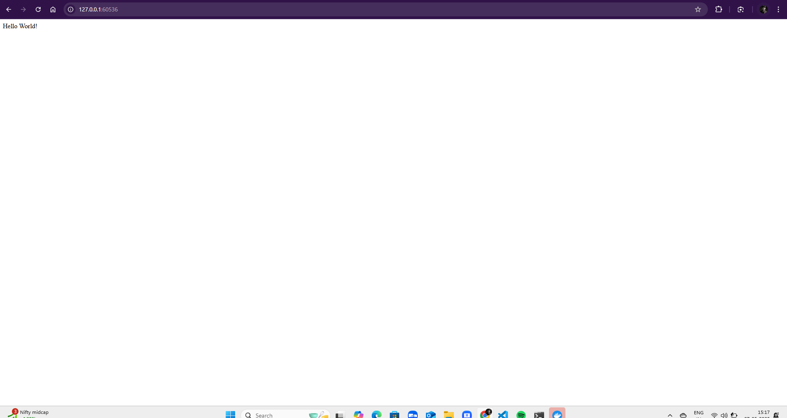

# CI/CD Pipeline (Github Actions + Docker + Minikube)

## Objective 
> This project demonstrates a complete CI/CD pipeline using Github Actions, Docker, Dockerhub, and Kubernetes via Minikube. 

---

## Features 
- Build Docker image using Github Actions
- Push image to DockerHub
- Deploy image tom Minikue Kubernetes cluster
- Expose via NodePort and access in browser

--- 

## Tools Used
- GitHub Actions
- Docker & DockerHub 
- Minikube (local Kubernetes)
- kubectl

---

## Project Structure 

```
.
├── .github/
│   └── workflows/
│       └── main.yml
├── public/
│   └── node.svg
├── screenshots/
│   ├── Accessed-successfully.png
│   ├── build-succesfully.pngg
│   ├── image-deployed.png
│   └── kubernetes-resources.png
├── .gitignore
├── app.json
├── deployment.yaml
├── Dockerfile
├── index.js
├── package.json
├── Procfile
├── README.md
└── service.yaml

```


## CI/CD Pipeline Overview
1. Code push triggers Github Actions
2. Builds Docker image
3. Pushes to Dockerhub
4. Pulls and deploys to Minikube

## Screenshots

1. Github Actions build success
- Image built and pushed to Dockerhub

2. DockerHub Image
 - Image deployed successfully

3. Minikube Pods & Service
 - Kubernetes resource created

4. Access via Browser
 - Hello world live on minikube 


---

## Run locally 

```
minikube start 
kubectl apply -f deployment.yaml
kubectl apply -f service.yaml
minikube ip 

```

